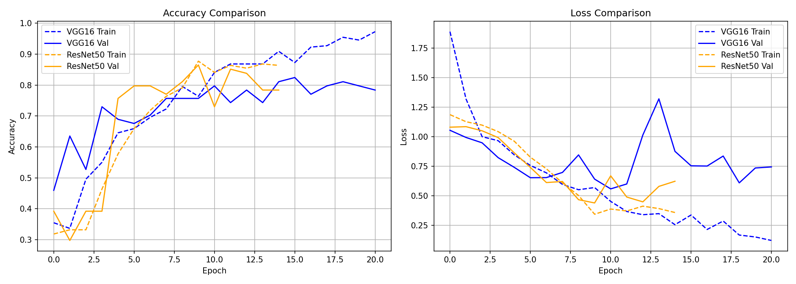

# Tea Leaf Disease Classification — Model Comparison Report

**Course:** Deep Learning Assignment 02  
**Models Compared:** VGG16 vs ResNet50  
**Task:** 3-Class Tea Leaf Disease Classification  
**Classes:** Algal Leaf · Brown Blight · White Spot  

---

## 1. Introduction

This report presents a comparative analysis of two transfer learning architectures —
**VGG16** and **ResNet50** — applied to a tea leaf disease classification task.
Both models were pretrained on ImageNet and fine-tuned using a differential learning
rate strategy, where frozen backbone layers were updated at a very low learning rate
(`1e-5`) and the newly added classifier head was trained at a higher rate (`1e-3`).

### 1.1 Dataset Summary

| Split      | Images |
|------------|--------|
| Train      | 220    |
| Validation | 74     |
| Test       | 74     |
| **Total**  | **368**|

**Class distribution:** Stratified 60 / 20 / 20 split across 3 disease classes.

---

## 2. Model Architectures

### 2.1 VGG16

- **Backbone:** Pretrained VGG16 (ImageNet weights)
- **Frozen layers:** `features[0:24]` (early convolutional blocks)
- **Unfrozen layers:** `features[24:]` — last convolutional block (lr = `1e-5`)
- **Custom classifier head (lr = `1e-3`):**
  ```
  Linear(25088 → 1024) → ReLU → Dropout(0.5)
  Linear(1024 → 256)   → ReLU → Dropout(0.3)
  Linear(256 → 3)
  ```

### 2.2 ResNet50

- **Backbone:** Pretrained ResNet50 (ImageNet weights)
- **Frozen layers:** `layer1`, `layer2` (early residual blocks)
- **Unfrozen layers:** `layer3`, `layer4` (lr = `1e-5`)
- **Custom FC head (lr = `1e-3`):** Replaced with 3-class output layer

---

## 3. Training Configuration

| Parameter         | Value                                  |
|-------------------|----------------------------------------|
| Optimizer         | Adam (differential learning rates)     |
| Loss function     | CrossEntropyLoss                       |
| LR Scheduler      | ReduceLROnPlateau (factor=0.5, patience=3) |
| Max epochs        | 25                                     |
| Early stopping    | patience = 5                           |
| Batch size        | 16                                     |

### Data Augmentation (Training only)

- Random horizontal flip (p=0.5)
- Random vertical flip (p=0.2)
- Random rotation (±20°)
- Color jitter (brightness=0.3, contrast=0.3, saturation=0.2)
- Resize to 224×224, Normalize with ImageNet mean/std

---

## 4. Training Results

### 4.1 Epoch-by-Epoch Training Log

#### VGG16 (Stopped at Epoch 21 — Early Stopping)

| Epoch | Train Loss | Train Acc | Val Loss | Val Acc |
|-------|-----------|-----------|----------|---------|
| 1     | 1.8902    | 0.3545    | 1.0544   | 0.4595  |
| 2     | 1.3192    | 0.3364    | 0.9934   | 0.6351  |
| 3     | 1.0001    | 0.4955    | 0.9481   | 0.5270  |
| 4     | 0.9659    | 0.5500    | 0.8223   | 0.7297  |
| 5     | 0.8462    | 0.6455    | 0.7403   | 0.6892  |
| 6     | 0.7565    | 0.6591    | 0.6524   | 0.6757  |
| 7     | 0.6936    | 0.6955    | 0.6535   | 0.7027  |
| 8     | 0.5957    | 0.7227    | 0.6973   | 0.7568  |
| 9     | 0.5507    | 0.7955    | 0.8456   | 0.7568  |
| 10    | 0.5692    | 0.7636    | 0.6405   | 0.7568  |
| 11    | 0.4517    | 0.8409    | 0.5578   | 0.7973  |
| 12    | 0.3662    | 0.8682    | 0.5995   | 0.7432  |
| 13    | 0.3390    | 0.8682    | 1.0140   | 0.7838  |
| 14    | 0.3479    | 0.8682    | 1.3208   | 0.7432  |
| 15    | 0.2542    | 0.9091    | 0.8759   | 0.8108  |
| 16    | 0.3364    | 0.8727    | 0.7534   | 0.8243  |
| 17    | 0.2138    | 0.9227    | 0.7513   | 0.7703  |
| 18    | 0.2854    | 0.9273    | 0.8360   | 0.7973  |
| 19    | 0.1665    | 0.9545    | 0.6088   | 0.8108  |
| 20    | 0.1503    | 0.9455    | 0.7349   | 0.7973  |
| 21    | 0.1207    | 0.9727    | 0.7438   | 0.7838  |

> ✅ **Best Val Acc: 0.8243** (Epoch 16)

---

#### ResNet50 (Stopped at Epoch 15 — Early Stopping)

| Epoch | Train Loss | Train Acc | Val Loss | Val Acc |
|-------|-----------|-----------|----------|---------|
| 1     | 1.1869    | 0.3182    | 1.0806   | 0.3919  |
| 2     | 1.1270    | 0.3318    | 1.0850   | 0.2973  |
| 3     | 1.0981    | 0.3318    | 1.0498   | 0.3919  |
| 4     | 1.0428    | 0.4636    | 0.9924   | 0.3919  |
| 5     | 0.9617    | 0.5773    | 0.8633   | 0.7568  |
| 6     | 0.8263    | 0.6591    | 0.7401   | 0.7973  |
| 7     | 0.7277    | 0.7182    | 0.6114   | 0.7973  |
| 8     | 0.6081    | 0.7636    | 0.6205   | 0.7703  |
| 9     | 0.5017    | 0.7909    | 0.4661   | 0.8108  |
| 10    | 0.3430    | 0.8773    | 0.4386   | 0.8649  |
| 11    | 0.3871    | 0.8409    | 0.6683   | 0.7297  |
| 12    | 0.3704    | 0.8636    | 0.4886   | 0.8514  |
| 13    | 0.4114    | 0.8545    | 0.4478   | 0.8378  |
| 14    | 0.3908    | 0.8682    | 0.5789   | 0.7838  |
| 15    | 0.3574    | 0.8636    | 0.6224   | 0.7838  |

> ✅ **Best Val Acc: 0.8649** (Epoch 10)

---

### 4.2 Accuracy & Loss Curves

> 📊 **Insert the saved plot here:**  
> `accuracy_loss_comparison.png` — generated by `plot_history(vgg_history, resnet_history)`



---

## 5. Test Set Evaluation

### 5.1 VGG16 — Classification Report (Test Set)

|               | Precision | Recall | F1-Score | Support |
|---------------|-----------|--------|----------|---------|
| Algal Leaf    | 0.94      | 0.65   | 0.77     | 23      |
| Brown Blight  | 0.73      | 0.83   | 0.78     | 23      |
| White Spot    | 0.78      | 0.89   | 0.83     | 28      |
| **Accuracy**  |           |        | **0.80** | 74      |
| Macro avg     | 0.82      | 0.79   | 0.79     | 74      |
| Weighted avg  | 0.81      | 0.80   | 0.80     | 74      |

### 5.2 VGG16 — Confusion Matrix

> 📊 **Insert image here:**  
> `vgg16_confusion_matrix.png` — saved during evaluation


---

### 5.3 ResNet50 — Classification Report (Test Set)

|               | Precision | Recall | F1-Score | Support |
|---------------|-----------|--------|----------|---------|
| Algal Leaf    | 1.00      | 0.87   | 0.93     | 23      |
| Brown Blight  | 0.91      | 0.87   | 0.89     | 23      |
| White Spot    | 0.84      | 0.96   | 0.90     | 28      |
| **Accuracy**  |           |        | **0.91** | 74      |
| Macro avg     | 0.92      | 0.90   | 0.91     | 74      |
| Weighted avg  | 0.91      | 0.91   | 0.91     | 74      |

### 5.4 ResNet50 — Confusion Matrix

> 📊 **Insert image here:**  
> `resnet50_confusion_matrix.png` — saved during evaluation


---

## 6. Comparative Summary

| Metric                     | VGG16         | ResNet50      |
|----------------------------|---------------|---------------|
| Best Validation Accuracy   | **82.43%**    | **86.49%**    |
| Best Val Accuracy Epoch    | Epoch 16      | Epoch 10      |
| Epochs Before Early Stop   | 21            | 15            |
| Test Accuracy              | **80.00%**    | **91.00%**    |
| Macro F1-Score             | 0.79          | 0.91          |
| Weighted F1-Score          | 0.80          | 0.91          |
| Best Class (F1)            | White Spot    | Algal Leaf    |
| Worst Class (F1)           | Algal Leaf    | Brown Blight  |

---

## 7. Analysis & Observations

### 7.1 Convergence Speed
- **ResNet50** converged significantly faster — reaching 86.49% validation accuracy by epoch 10.
- **VGG16** required 16 epochs to peak, with more fluctuation in validation loss, suggesting
  higher sensitivity to the learning rate schedule.

### 7.2 Overfitting Tendency
- VGG16 shows growing divergence between training accuracy (97%+) and validation accuracy (~82%)
  by epoch 21, indicating overfitting on the small training set.
- ResNet50 shows a more stable gap, benefiting from residual connections and stronger regularization.

### 7.3 Class-Level Performance

#### VGG16
- **White Spot** was the easiest class (F1 = 0.83), with high recall (89%).
- **Algal Leaf** was the hardest class (F1 = 0.77), with low recall (65%) —
  many algal leaf images were misclassified as other diseases.
- **Brown Blight** had balanced precision/recall (F1 = 0.78).

#### ResNet50
- **Algal Leaf** was the strongest class (F1 = 0.93), with perfect precision (1.00) —
  every image predicted as algal leaf was correct.
- **Brown Blight** was the weakest class (F1 = 0.89), though still strong.
- **White Spot** achieved the highest recall (96%), correctly identifying nearly all white spot cases.
- Overall, ResNet50 shows more balanced and significantly higher per-class performance than VGG16.

### 7.4 Impact of Differential Learning Rates
- The use of differential learning rates allowed:
  - The pretrained backbone to update very slowly, preserving ImageNet features.
  - The new classifier head to learn aggressively from the tea-specific dataset.
- This strategy was critical on a small dataset (220 training images).

---

## 8. Conclusion

**ResNet50 outperforms VGG16** on this tea leaf disease classification task,
achieving a higher best validation accuracy (86.49% vs 82.43%) and converging
faster (10 epochs vs 16 epochs).

Both models benefit from transfer learning and differential learning rates, but
ResNet50's skip connections make it more effective at fine-tuning on limited data.

### Recommendation
> Use **ResNet50** for deployment, saving the best checkpoint (`best_ResNet50.pth`)
> for inference. Consider further improvement via:
> - Collecting more training data
> - Test-time augmentation
> - Ensemble of both models

---

## 9. Appendix

### A. Saved Files
| File                          | Description                         |
|-------------------------------|-------------------------------------|
| `best_VGG16.pth`              | Best VGG16 model weights            |
| `best_ResNet50.pth`           | Best ResNet50 model weights         |
| `accuracy_loss_comparison.png`| Training/validation curves (both)  |
| `vgg16_confusion_matrix.png`  | VGG16 test confusion matrix         |
| `resnet50_confusion_matrix.png`| ResNet50 test confusion matrix     |

### B. Environment
- PyTorch
- torchvision
- scikit-learn
- matplotlib / seaborn
